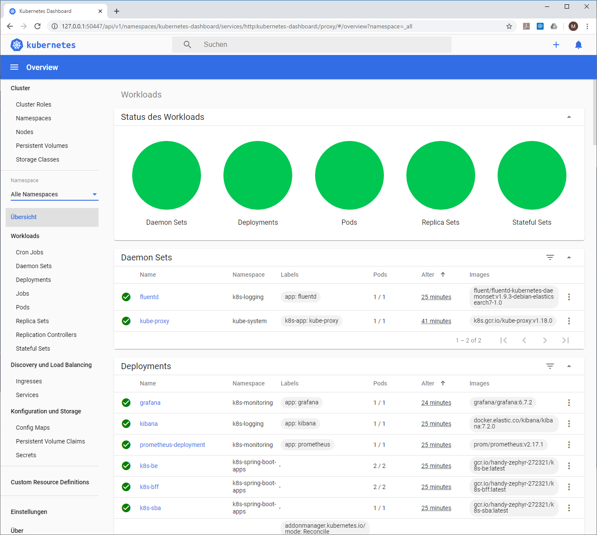
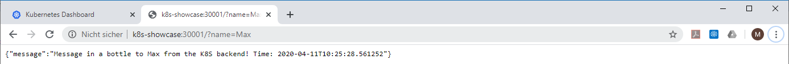
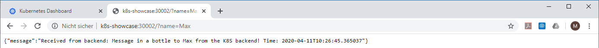
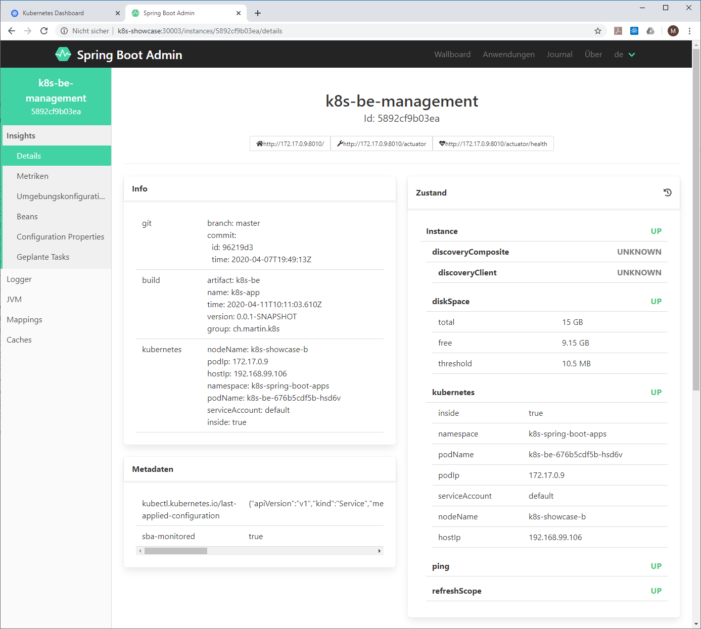
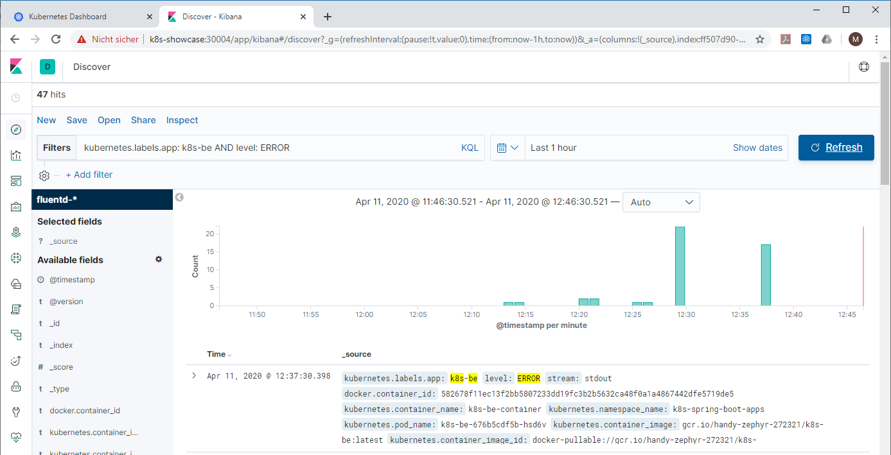
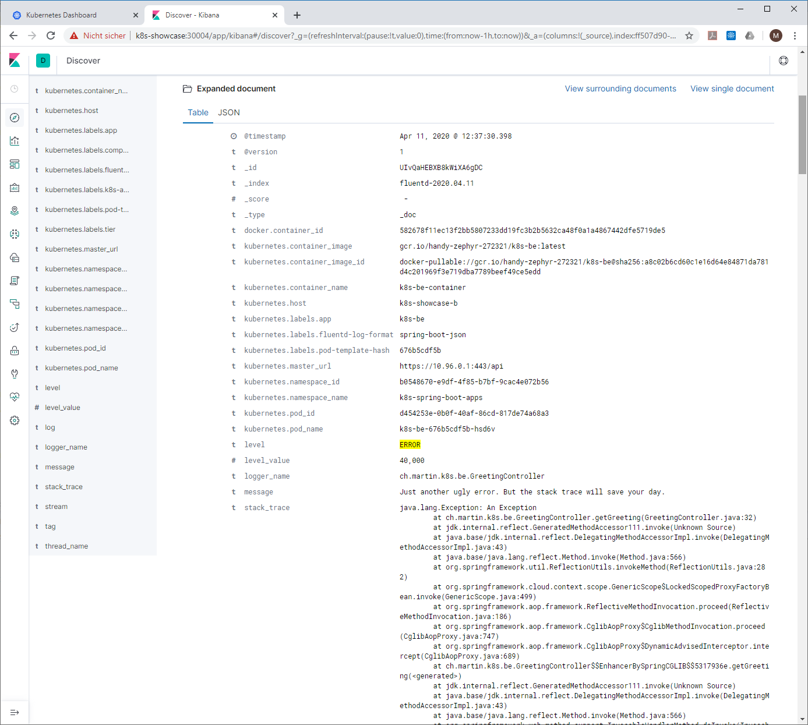
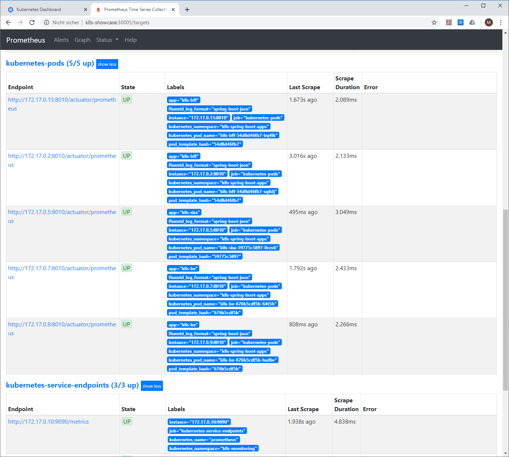
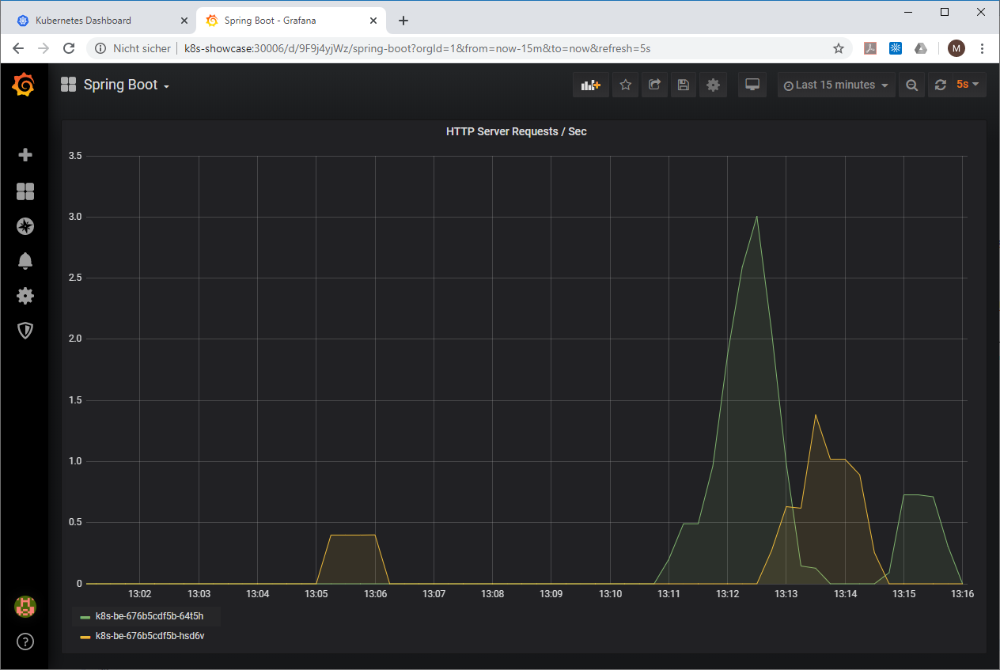
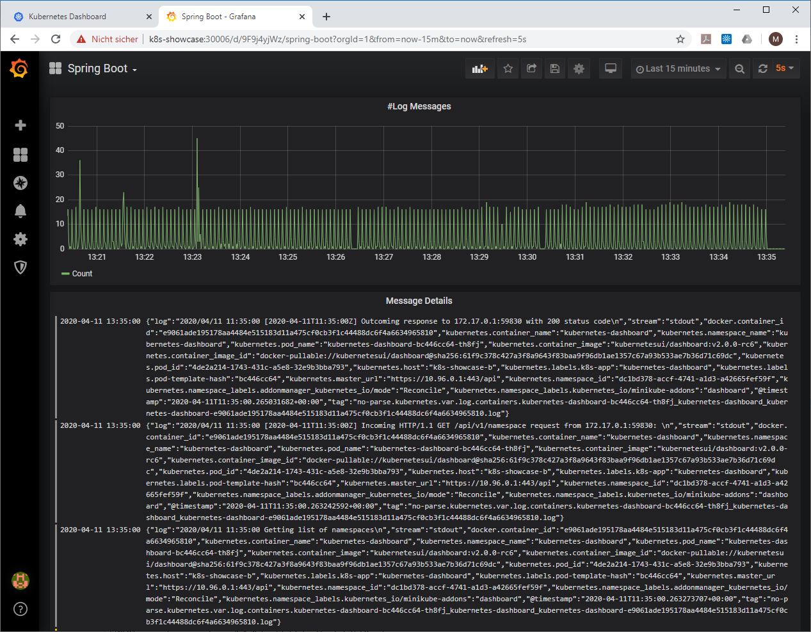

# k8s-demo

This showcase highlights the following key concepts for deploying Spring Boot applications to a Kubernetes cluster:

*   Creating docker images for Spring Boot applications using the [Jib Maven plugin](https://github.com/GoogleContainerTools/jib) 
*   Integration of Spring Boot with Kubernetes using [Spring Cloud Kubernetes](https://spring.io/projects/spring-cloud-kubernetes) 
*   Dynamic configuration for Spring Boot with ConfigMaps.
*   Readiness/Liveness Probes backed by Spring Boot health actuator.
*	Service lookup with Spring Boot's Feign client and Kubernetes service objects.
*	Service discovery with Spring Boot's discovery client.
*   Monitoring of Spring Boot applications with [Spring Boot Admin](https://github.com/codecentric/spring-boot-admin).
*	Centralized and structured logging for Spring Boot apps using a JSON logback appender.
*   Metrics scraping backed by Spring Boot's [Micrometer/Prometheus](https://docs.spring.io/spring-metrics/docs/current/public/prometheus) implementation.
*	How to use visualization tools to analyze logs and metrics.

After completing the installation described below, you will control a complete application stack with two Spring Boot applications, a logging stack based on [fluentd](https://www.fluentd.org)/[ElasticSearch](https://www.elastic.co)/[Kibana](https://www.elastic.co), a monitoring stack with [Prometheus](https://prometheus.io)/[Grafana](https://grafana.com) and a [Spring Boot Admin](https://github.com/codecentric/spring-boot-admin) application.

## Steps to install

Feel free to also download and take a look at a WEBM [video](https://github.com/haqer1/k8s-spring_boot-elastic-kibana-graphana-demo/raw/refs/heads/master/assets/k8s-spring_boot-elastic-kibana-graphana-demo.webm "WEBM video") providing an illustration of the steps below.

### Create a Cluster on Minikube

This guide assumes that you have VirtualBox installed on your computer or a similar virtualization software.
Install [minikube](https://kubernetes.io/docs/setup/learning-environment/minikube/ "Minukube") on your local machine.
Create a cluster with the following parameters (FYI: this demo has used about 12GB of disk space):

	minikube start -p k8s-demo --memory='4096mb'

or

	minikube start -p k8s-demo --memory='4096mb' --disk-size='13632mb'
 
You should see an output like this:

	🐳  Preparing Kubernetes v1.32.0 on Docker 27.4.1 ...
	...
	🔥  Creating docker container (CPUs=2, Memory=4096MB) ...
	...
	🌟  Enabled addons: storage-provisioner, default-storageclass
	...
	🏄  Done! kubectl is now configured to use "k8s-demo" cluster and "default" namespace by default

Making sure that k8s-demo is your current minikube profile might simplify things: execute `minikube profile k8s-demo` and then verify the current profile with `minikube profile`.
You should see `* k8s-demo` as confirmation.

### Start the Kubernetes Dashboard

The Kubernetes Dashboard is very useful when it comes to to track and monitor what is happening your cluster. Open a new command window or shell and start the Kubernetes Dashbord with `minikube dashboard`. This will open your Browser showing the inital Dashboard screen.

Next check the IP address which is assigned to your cluster with `minikube ip`. You will get a response like `192.168.99.104`. Keep this IP address in mind or even better add it as host name `k8s-demo` to `C:\Windows\System32\drivers\etc\hosts` (You need admin permission to do this). You will need it later to access the apps running inside the cluster.
 
### Deploy the Application Stack

You can install the full application stack at once. Navigate to the top level directory of the Git project and execute:

	kubectl apply -f k8s-deployment

This will apply all deployment files (*.k8s.yml) in the `k8s-deployment` directory on your Minikube cluster. You should see the following output:

	namespace/k8s-spring-boot-apps created
	namespace/k8s-logging created
	namespace/k8s-monitoring created
	persistentvolume/pv0001 created
	service/elasticsearch created
	statefulset.apps/es-cluster created
	serviceaccount/fluentd created
	clusterrole.rbac.authorization.k8s.io/fluentd created
	clusterrolebinding.rbac.authorization.k8s.io/fluentd created
	configmap/fluentd-config created
	daemonset.apps/fluentd created
	persistentvolumeclaim/grafana-storage created
	deployment.apps/grafana created
	service/grafana created
	service/kibana created
	deployment.apps/kibana created
	service/kibana configured
	clusterrole.rbac.authorization.k8s.io/prometheus created
	clusterrolebinding.rbac.authorization.k8s.io/prometheus created
	configmap/prometheus-server-conf created
	deployment.apps/prometheus created
	service/prometheus created
	clusterrolebinding.rbac.authorization.k8s.io/admin-default created
	configmap/k8s-demo-be created
	deployment.apps/k8s-demo-be created
	service/k8s-demo-be created
	deployment.apps/k8s-demo-bff created
	service/k8s-demo-bff created
	configmap/k8s-demo-sba created
	deployment.apps/k8s-demo-sba created
	service/k8s-demo-sba created

### Verify Deployment

After a few minutes the cluster should have started all pods. Check the dashboard that everything is green.

 

You can now visit the installed apps by using the following links: (The hostname `k8s-demo` should point to your cluster ip address)

| URL                                  | Description                                                                                             |
|--------------------------------------|---------------------------------------------------------------------------------------------------------|
| <http://k8s-demo:30001?name=Resat> | Request to the backend (k8s-demo-be). This will return a simple message. It will also generate an ERROR-level log message with ID as example. |
| <http://k8s-demo:30002?name=Resat> | Request to the backend-for-frontend (k8s-demo-bff). This will query the backend for a message and return it.                                  |
| <http://k8s-demo:30001/tip>        | Request to another backend operation (k8s-demo-be). This will return a different message & generate an INFO-level log message with a marker.  |
| <http://k8s-demo:30003>          | Opens the Spring Boot Admin UI                                                                          |
| <http://k8s-demo:30004>          | Opens the Kibana UI                                                                                     |
| <http://k8s-demo:30005>          | Opens the Prometheus Admin UI                                                                           |
| <http://k8s-demo:30006>          | Opens the Grafana UI (Use admin/admin for first login)                                                  |

#### The Spring Boot Backend (k8s-demo-be)

The backend is a simple REST service which will return a message dependent on Spring active profile(s) like "Development-specific config message ..." upon request (or "Message from embedded application.yml ..." if ConfigMap-based config is not functional). You have to provide a name parameter. The message text is configured via a Kubernetes ConfigMap and can be changed without a restart (or redeployment). This is achieved using [Spring Cloud Kubernetes](https://spring.io/projects/spring-cloud-kubernetes) and Spring Boot's `@RefreshScope` annotation. (See deployment file `spring-boot-apps.k8s.yml`)

 

Calling this service will also produce log and metrics data which can be analyzed later.

#### The Spring Boot Backend-for-frontend (k8s-demo-bff)

The backend-for-frontend uses a [Feign Client](https://cloud.spring.io/spring-cloud-netflix/multi/multi_spring-cloud-feign.html) which queries the backend for messages. The Feign Client is annotated with `@FeignClient(url = "http://k8s-demo-be")` and automatically finds the backend with the service object's name `k8s-demo-be` (this is more tricky if Docker is in rootles mode).

Both Spring Boot applications provide a full set of [actuator endpoints](https://docs.spring.io/spring-boot/docs/current/reference/html/production-ready-features.html) which will be used by the following monitoring tools. 

#### Spring Boot Admin (k8s-demo-sba)

The Spring Boot Admin application is used to gather build, configuration and health status information of the Spring Boot apps. It uses the discovery client provided with [Spring Cloud Kubernetes](https://spring.io/projects/spring-cloud-kubernetes) and scans the Kubernetes API for service objects with the label `sba-monitored: "true"`.

 

#### Kibana

Kibana is a powerful tool to analyze data provided by ElasticSearch. As first step you must make the log index available for searching: Select `Discover` from the menu. Then create an index pattern with `fluentd-*` and select `@timestamp` as time field. Now you can search through the logs. Enter `kubernetes.labels.app: k8s-demo-be AND level:ERROR` as filter and click Refresh. You should see the error log entries created by the Spring Boot app `k8s-demo-be`.

 

The log messages produced by the Spring Boot apps are written as JSON to stdout. This is the most efficient way to forward it to the fluentd log daemon, because there is no further parsing required. Additionally, log messages with multiple lines (like the Java stacktrace shown below) do not pose any problems as it might happen with unstructured text output.

 
 	
#### Prometheus

Prometheus is a database for storing multi dimensional metrics based on a time line. It is used to scrape the metrics provided by the Spring Boot app's actuators and also by the Kubernetes system components. Open the Prometheus UI and select `targets`. In the `Kubernetes Pods` section you should see that Prometheus has detected the Spring Boot apps as scraping targets. This happens automatically because their Kubernetes service object is annotated with appropriate `prometheus.io/*` values.  

 
  
#### Grafana

With Grafana you can analyze and visualize the data provided by Prometheus and ElasticSearch. First define a datasource for Prometheus using `http://prometheus:9090`. Now create a dashboard and add chart with the PromQL expression `rate(http_server_requests_seconds_count{app="k8s-demo-be"}[1m])`. This will give you visualization of HTTP server requests per second for the Spring Boot app `k8s-demo-be`.

 
It is also possible to use ElasticSearch as data source: Create a data source using `http://elasticsearch.k8s-logging.svc.cluster.local:9200`, index-name `fluentd-*`, pattern `no-pattern` and version `7.0+`. Then add a table to your dashboard and you will see the log messages stored by fluentd to ElasticSearch.
 

